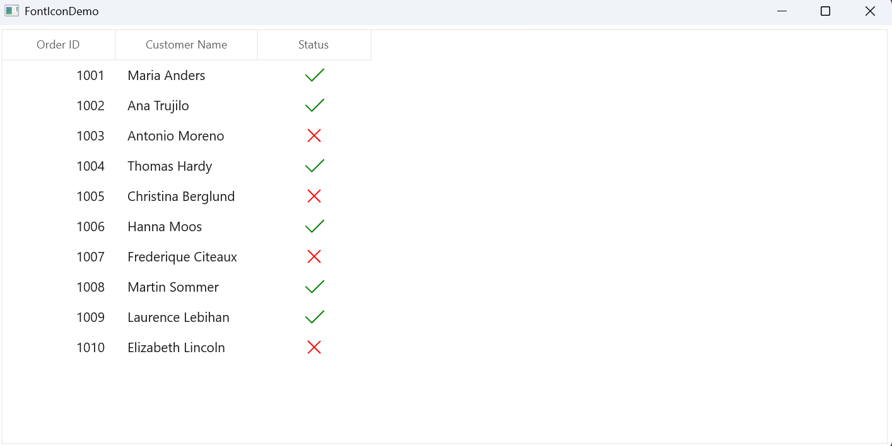

# How to show font icons for checked and unchecked states for GridCheckBoxColumn in WinUI DataGrid?

In [WinUI DataGrid](https://www.syncfusion.com/winui-controls/datagrid) (SfDataGrid), the default [GridCheckBoxColumn](https://help.syncfusion.com/cr/winui/Syncfusion.UI.Xaml.DataGrid.GridCheckBoxColumn.html) can be replaced with a **FontIcon** by implementing a custom cell renderer (GridCellCustomCheckBoxRenderer). The OnInitializeEditElement method sets the font icon with a helper method (UpdateIcon) selecting a tick or cross glyph and applying green or red foreground colors based on the bounded underlying property value.

The FontIcon’s  **Tapped** event is used in OnEditElementLoaded to toggle the status value at runtime and immediately update the icon. To prevent event leaks, the handler is detached in both OnEditElementUnloaded and OnUnwireEditUIElement.

 
 ```csharp
 
// Remove the existing Renderer
this.dataGrid.CellRenderers.Remove("CheckBox");

// Add the custom Renderer
this.dataGrid.CellRenderers.Add("CheckBox", new GridCellCheckBoxRendererExt());

//Renderer customization
public class GridCellCheckBoxRendererExt : GridCellCustomCheckBoxRenderer
{
     public GridCellCheckBoxRendererExt()
     {
         this.SupportsRenderOptimization = false;
         this.IsEditable = false;
     }

     public override void OnInitializeEditElement(DataColumnBase dataColumn, FontIcon uiElement, object dataContext)
     {
         var item = dataContext as OrderInfo;
         if (uiElement == null || item == null)
             return;
         UpdateIcon(uiElement, item.Status);
     }

     protected override void OnEditElementLoaded(object sender, RoutedEventArgs e)
     {
         var uiElement = sender as FontIcon;
         if (uiElement == null || uiElement.DataContext == null)
             return;
         uiElement.Tag = uiElement.DataContext;
         uiElement.Tapped += OnTapped;
     }

     private void OnTapped(object sender, TappedRoutedEventArgs e)
     {
         if (sender is FontIcon icon && icon.Tag is OrderInfo item)
         {
             item.Status = !item.Status;
             // Update the icon
             UpdateIcon(icon, item.Status);
         }
     }

     private void UpdateIcon(FontIcon icon, bool isChecked)
     {
         if (isChecked)
         {
             icon.Glyph = "\uE8FB"; // Tick
             icon.Foreground = new SolidColorBrush(Colors.Green);
         }
         else
         {
             icon.Glyph = "\uE711"; // Cross
             icon.Foreground = new SolidColorBrush(Colors.Red);
         }
     }
     protected override void OnEditElementUnloaded(object sender, RoutedEventArgs e)
     {
            var uiElement = sender as FontIcon;
            if (uiElement == null)
              return;
            uiElement.Tapped -= OnTapped;
     }

     protected override void OnUnwireEditUIElement(FontIcon uiElement)
     {
           if (uiElement != null)
              uiElement.Tapped -= OnTapped;
     }
 } 
 ```

 

Take a moment to peruse the [WinUI DataGrid - custom renderer ](https://help.syncfusion.com/winui/datagrid/column-types#creating-renderer) documentation, to learn more about custom renderer with examples.